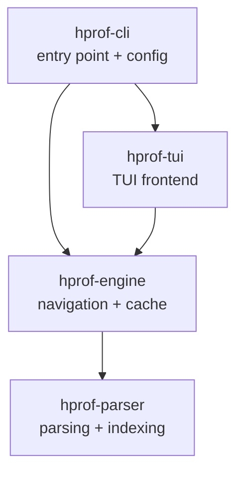
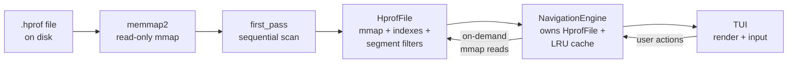
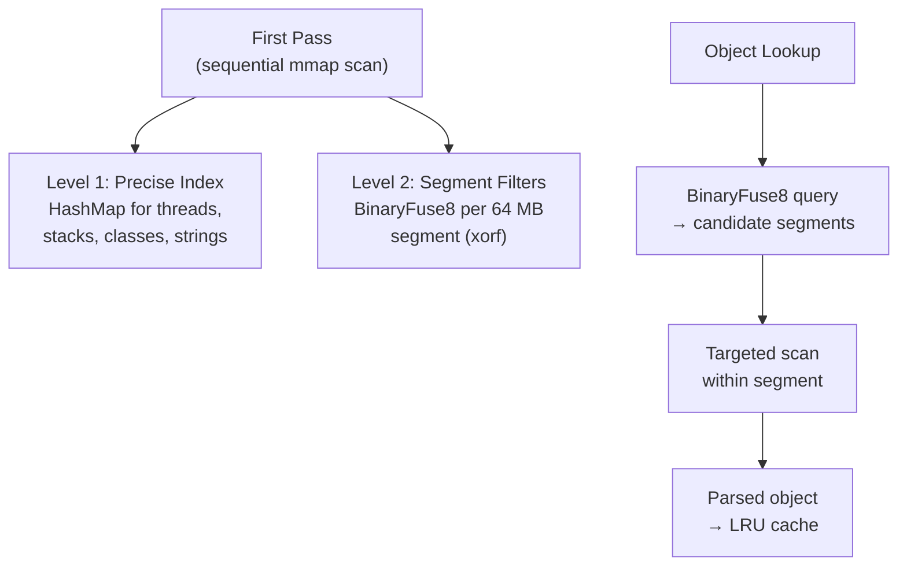
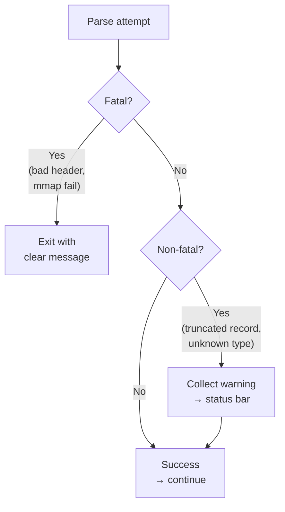

# Architecture Decision Document

_This document builds collaboratively through step-by-step discovery. Sections are appended as we work through each architectural decision together._

## Project Context Analysis

### Requirements Overview

**Functional Requirements:**
35 FRs in 7 groups covering the full MVP lifecycle:
file opening and header parsing, single-pass structural
indexing with segment-level fast-lookup, thread-centric
navigation (threads > stack frames > local variables >
recursive object expansion), inline primitives with lazy
complex object expansion, human-readable Java type display,
paginated large collections (batches of 1000), LRU eviction
by subtree with configurable memory budget, progress bar
and loading indicators, TOML config with CLI overrides.

**Non-Functional Requirements:**
11 NFRs driving architectural decisions:
- Performance: indexing < 10 min / 70 GB (NFR1),
  navigation < 1s (NFR2), collection expansion < 5s
  (NFR3), UI responsiveness at 16ms frame budget (NFR4),
  memory within configured budget (NFR5)
- Reliability: no crash on malformed input (NFR6),
  byte-accurate value display (NFR7), eviction/re-parse
  data integrity (NFR8), read-only file access (NFR9)
- Portability: Linux/macOS/Windows (NFR10),
  single binary with no runtime dependencies (NFR11)

**Scale & Complexity:**
- Primary domain: Desktop tool — binary format parsing
  with interactive TUI
- Complexity level: Medium-high
- Estimated architectural components: 6-8
  (parser, indexer, object resolver, memory manager,
  navigation engine, UI layer, config, error handling)

### Technical Constraints & Dependencies

- Rust edition 2024 (nightly or recent stable)
- Hprof binary format versions 1.0.1 and 1.0.2
  with dynamic ID size (4 or 8 bytes)
- Memory-mapped file access for files up to 100 GB
- Single-file analysis only (no multi-file, no index
  persistence)
- Interactive-only in MVP (no batch/scriptable mode)
- TUI frontend (ratatui + crossterm) with trait
  abstraction for future GUI migration (egui)

### Cross-Cutting Concerns Identified

- **Memory management**: Affects parser, object resolver,
  navigation, and UI — budget enforcement and LRU
  eviction must be consistent across all components
- **Error tolerance**: Parsing, indexing, and navigation
  must all handle malformed/truncated data gracefully
  without propagating crashes
- **I/O performance**: Indexing throughput, object
  resolution latency, and pagination speed all depend
  on efficient file access patterns
- **Data integrity**: Byte-accurate values must be
  preserved through parse, cache, evict, and re-parse
  cycles — forensic correctness is non-negotiable
- **UI abstraction**: Every user-facing interaction must
  go through a trait boundary to enable frontend
  migration without engine changes

## Starter Template Evaluation

### Primary Technology Domain

Rust native desktop tool — binary format parser with
interactive TUI. No web/mobile framework starters apply.

### Starter Options Considered

This project does not fit the typical starter template
pattern (Next.js, T3, etc.). Rust projects are initialized
via `cargo new` and dependencies are added individually.
No maintained "hprof parser starter" or "TUI analysis tool
starter" exists in the Rust ecosystem.

### Selected Approach: Cargo Init + Crate Selection

**Rationale:** Rust projects are built bottom-up from
individual crates. The project is already initialized
with `cargo new`. The architectural foundation comes from
crate selection and module organization, not a starter
template.

**Initialization Command:**

```bash
cargo init hprof-visualizer
```

**Core Crates (from PRD and brainstorming):**
- `memmap2` — memory-mapped file access
- `ratatui` — TUI framework
- `crossterm` — terminal backend for ratatui
- `toml` / `serde` — configuration parsing
- `clap` — CLI argument parsing

**Architectural Decisions Established:**
- Language & Runtime: Rust edition 2024
- Build Tooling: Cargo (standard Rust toolchain)
- Testing: Built-in `#[test]` + `cargo test`
- Linting: `cargo clippy`
- Formatting: `cargo fmt`
- Code Organization: Rust module system with
  clear separation between engine and frontend
- No external build tools, bundlers, or code
  generators required

**Note:** Exact crate versions will be resolved at
implementation time using the latest stable releases.

## Core Architectural Decisions

### Decision Priority Analysis

**Critical Decisions (Block Implementation):**
- Indexing strategy: Hybrid (precise index for
  metadata + fixed segments with Binary Fuse filter)
- Probabilistic filter: BinaryFuse8 via `xorf` crate
- Cache eviction: LRU by expanded subtree
- Memory tracking: Explicit counting via `MemorySize`
  trait
- UI abstraction: High-level Navigation Engine trait,
  frontend as thin render client
- Error strategy: `thiserror` enum with fatal/non-fatal
  distinction

**Important Decisions (Shape Architecture):**
- CI/CD: GitHub Actions (build matrix
  Linux/macOS/Windows, test, clippy, fmt)
- Logging: `tracing` crate for structured logging
- Frontend selection: CLI flag (`--gui`) to choose
  between TUI and GUI, one active at a time

**Deferred Decisions (Post-MVP):**
- Distribution strategy (pre-compiled binaries,
  cross-compilation)
- Segment size tuning (starting at 64 MB, adjustable
  based on benchmarks)

### Data Architecture

**Indexing Strategy: Hybrid Two-Level**
- Level 1 (precise): HashMap indexes for threads,
  stack frames, class definitions, structural strings.
  Built during first pass, kept in memory permanently.
- Level 2 (probabilistic): BinaryFuse8 filter per
  fixed-size segment for object ID lookup. Built during
  first pass. On query, filter identifies candidate
  segments, then targeted scan resolves the object.
- Crate: `xorf` (BinaryFuse8 — ~9 bits/element,
  ~0.4% false positive rate, immutable, cache-friendly)

**Cache & Eviction: LRU by Subtree**
- Unit of eviction: the full expanded subtree of a
  navigated object (e.g., all fields expanded under
  a thread's local variable)
- Eviction trigger: 80% of memory budget reached
- Memory tracking: each parsed structure implements
  a `MemorySize` trait returning its estimated heap
  footprint. Global counter accumulates on parse,
  decrements on eviction.
- `MemorySize` implementation convention:
  `std::mem::size_of::<Self>()` for the static part
  + manual counting of heap allocations (Vec capacity,
  String length, HashMap entries). Unit tests must
  verify coherence between reported size and actual
  allocations for all key structs.
- Re-parse guarantee: evicted data can be re-parsed
  from mmap with identical results (NFR8)

### Error Handling

**Error Representation:**
- `thiserror` crate for enum `HprofError` with
  specific variants: `TruncatedRecord`, `InvalidId`,
  `UnknownRecordType`, `CorruptedData`,
  `UnsupportedVersion`, `MmapFailed`, `IoError`
- Fatal errors: invalid header, unreadable file,
  mmap failure — application exits with clear message
- Non-fatal errors: truncated records, unknown types,
  unresolved references — collected as warnings,
  displayed in status bar, navigation continues

**Error Tolerance Testing Strategy:**
- Test fixtures: deliberately corrupted hprof files
  (truncated at various offsets, corrupted record
  headers, invalid ID sizes, unknown record types)
- Integration tests: verify warnings produced and
  navigation continues on degraded files
- Optional future: fuzzing via `cargo-fuzz` or
  `arbitrary` crate for deeper robustness coverage

### Frontend Architecture

**Navigation Engine Trait (High-Level API):**
- `list_threads()`, `select_thread(id)`,
  `get_stack_frames(thread_id)`,
  `get_local_variables(frame_id)`,
  `expand_object(object_id)`,
  `get_page(collection_id, offset, limit)`
- Engine owns all navigation logic, caching,
  pagination, and memory management
- Frontend is a thin client: receives rendered
  state, sends user actions
- One frontend active at a time, selected via CLI
  flag (TUI default, `--gui` for egui in future)
- Trait is evolutive: Phase 2 methods
  (`pin_favorite()`, `filter_threads()`,
  `group_threads_by_pool()`) will be added with
  default implementations — no breaking changes
  to existing frontend code

**Engine Factory Pattern:**
- `hprof-engine` exposes `Engine::from_file(path,
  config)` as the single entry point for
  construction
- Internally creates `HprofFile` (mmap + indexing)
  and wraps it in the engine
- `hprof-cli` never imports from `hprof-parser`
  directly — parser types stay engine-internal

### Infrastructure & Deployment

**CI/CD: GitHub Actions**
- Build matrix: Linux, macOS, Windows
- Pipeline: `cargo fmt --check` > `cargo clippy`
  > `cargo test` > `cargo build --release`
- Triggered on push and PR to main

**Logging: `tracing`**
- Structured logging for parsing performance,
  error tracking, and memory budget monitoring
- Log levels: ERROR (fatal), WARN (non-fatal
  parse issues), INFO (indexing progress),
  DEBUG/TRACE (development)

**Distribution: Deferred**
- MVP: `cargo install` from repository
- Future: pre-compiled release binaries via
  GitHub Actions when open-source readiness reached

### Decision Impact Analysis

**Implementation Sequence (dependency order, not
sprint plan — story decomposition is handled by
the epics/stories workflow):**
1. Set up Cargo workspace with 4 crates + CI
2. hprof-parser: error types, header parsing,
   test builder
3. hprof-parser: record parsing, mmap, first-pass
   indexer (precise + BinaryFuse8)
4. hprof-engine: NavigationEngine trait + factory
   + resolver
5. hprof-engine: LRU cache with MemorySize tracking
6. hprof-tui: TUI frontend as thin client
7. hprof-cli: config (TOML + clap) + memory budget

**Cross-Component Dependencies:**
- Parser depends on error handling enum
- Indexer depends on parser + `xorf`
- Navigation Engine depends on parser (internal)
  + LRU cache
- LRU cache depends on `MemorySize` trait
  (implemented by all parsed structures)
- Frontend depends only on Navigation Engine trait
- CLI depends on Engine (factory) + TUI, never
  on parser directly

## Implementation Patterns & Consistency Rules

### Naming Patterns

**Module & File Naming:**
- Modules: `snake_case`, un mot si possible
  (`parser`, `indexer`, `cache`, `engine`, `tui`)
- Files: same name as module (`parser.rs` or
  `parser/mod.rs` for sub-modules)

**Domain Type Naming:**
- Prefix with `Hprof` only when ambiguous with
  Rust standard types (e.g., `HprofThread` because
  `Thread` is ambiguous, but `StackFrame` is fine)
- All other naming follows CLAUDE.md conventions:
  PascalCase structs/traits, snake_case functions,
  UPPER_SNAKE_CASE constants

### Testing Patterns

**Test Organization:**
- Unit tests: `#[cfg(test)] mod tests` inline at
  the bottom of each source file (Rust idiom)
- Integration tests: `tests/` directory at workspace
  root for cross-module tests on real hprof fixtures

**Test Fixtures Strategy:**
- Small synthetic hprof files (few KB) committed
  in `tests/fixtures/` — built programmatically
  or hand-crafted for specific scenarios (truncated,
  corrupted headers, unknown records, 4/8-byte IDs)
- Large real-world hprof files: never committed.
  Benchmarks gated behind env var
  (`HPROF_BENCH_FILE=/path/to/large.hprof`),
  skipped by default in CI.

**Test Builder Location:**
- `HprofTestBuilder` lives in `hprof-parser` behind
  a `test-utils` feature flag:
  `crates/hprof-parser/src/test_utils.rs` with
  `#[cfg(feature = "test-utils")]`
- `hprof-parser` Cargo.toml defines:
  `[features] test-utils = []`
- Other crates and workspace integration tests
  use it as: `hprof-parser = { path = "...",
  features = ["test-utils"] }` in
  `[dev-dependencies]`
- Single builder used by unit tests, integration
  tests, and all crates — no duplication

### Error Propagation Patterns

**Strict Rules:**
- `unwrap()` and `expect()` forbidden outside tests.
  Production code uses `?` or explicit `match`.
- Error conversions via `impl From<X> for HprofError`
  through `thiserror` — never `unwrap()` on
  conversion
- Add context with `.map_err()` when `?` alone
  loses information (e.g., file offset that caused
  the error)

### Binary Parsing Patterns

**Approach: `Cursor` + `byteorder`**
- `std::io::Cursor` over mmap slices for sequential
  parsing
- `ReadBytesExt` trait for typed reads
  (`read_u32::<BigEndian>()`, etc.)
- Dynamic ID size: all ID reads go through a
  `read_id(cursor, id_size) -> u64` utility —
  never hardcode ID size
- Boundary validation: check remaining bytes before
  reading. Insufficient data returns
  `HprofError::TruncatedRecord`, never panics.

**Mmap Lifetime Rule:**
- `Cursor<&'a [u8]>` is tied to the mmap lifetime.
  Never store a Cursor that could outlive the
  mapping. Parse into owned types (`String`, `Vec`,
  structs with owned fields) before returning from
  parsing functions. The Cursor is transient — used
  within a parsing call, never persisted.

### Module Visibility Patterns

**Encapsulation Rules:**
- Each module exposes a minimal public API via `pub`
- Re-export public types from module root
  (`mod.rs` or module file). Consumers import from
  the module, not from internal sub-files.
- Private by default. `pub(super)` for parent-only
  visibility. `pub(crate)` only for types shared
  across modules without public exposure.

### Project Structure

**Workspace Layout:**
- Cargo workspace with crates under `crates/`
- Workspace-level `Cargo.toml` at project root

**Crate Decomposition:**
- `crates/hprof-parser` — binary parsing, domain
  types, first-pass indexing, BinaryFuse8
  construction, test builder (feature-gated).
  Parser and indexer are separate modules within
  the same crate (tightly coupled: indexer calls
  parser record-by-record).
- `crates/hprof-engine` — Navigation Engine trait,
  Engine factory (`from_file`), LRU cache,
  `MemorySize` tracking, object resolution,
  pagination logic
- `crates/hprof-tui` — ratatui frontend, thin
  client consuming Navigation Engine API
- `crates/hprof-cli` — entry point, `clap` CLI
  parsing, TOML config loading, memory budget
  calculation, frontend selection

**Dependency Direction:**
```
hprof-cli → hprof-engine → hprof-parser
          → hprof-tui → hprof-engine
```
Note: hprof-cli does NOT depend on hprof-parser.
Engine factory encapsulates parser internals.

**Crate Documentation:**
- Every `lib.rs` must have a `//!` module docstring
  describing the crate's single responsibility.
  This aligns with CLAUDE.md documentation
  requirements and ensures agents understand
  crate boundaries.

### Logging & Instrumentation Patterns

**Rules:**
- Use `tracing` macros (`info!`, `warn!`, `error!`,
  `debug!`, `trace!`) — never `println!` or
  `eprintln!` in production code
- One span per significant operation (segment
  indexing, object resolution, LRU eviction) with
  relevant fields (`segment_id`, `object_id`,
  `bytes_evicted`)
- Never log heap dump values — metadata only
  (offsets, sizes, types, counters)

### Enforcement Guidelines

**All AI Agents MUST:**
- Follow naming conventions from CLAUDE.md and
  patterns above without exception
- Use `?` propagation, never `unwrap()` in
  production code
- Route all ID reads through `read_id()` utility
- Keep module APIs minimal and re-export from
  module root
- Use `tracing` for all logging, never `println!`
- Parse into owned types, never persist Cursors
- Add `//!` docstring to every `lib.rs`

**Anti-Patterns:**
- Hardcoded ID size (4 or 8) anywhere in parsing
- `unwrap()` or `expect()` in non-test code
- `println!` for logging or debugging in committed
  code
- Direct import from internal sub-module files
- Logging heap dump content values
- Storing `Cursor` references beyond a parse call
- Creating a crate without `//!` module docstring

## Project Structure & Boundaries

### Complete Project Directory Structure

```
hprof-visualizer/
├── Cargo.toml                    # workspace manifest
├── Cargo.lock
├── config.toml                   # default config file
├── .gitignore
├── .github/
│   └── workflows/
│       └── ci.yml                # GitHub Actions pipeline
├── crates/
│   ├── hprof-parser/
│   │   ├── Cargo.toml
│   │   └── src/
│   │       ├── lib.rs            # crate root + re-exports
│   │       ├── error.rs          # HprofError enum (thiserror)
│   │       ├── header.rs         # header parsing, version
│   │       │                       detection, ID size (FR2)
│   │       ├── record.rs         # record-level parsing,
│   │       │                       unknown record skip (FR7)
│   │       ├── types.rs          # domain types: HprofThread,
│   │       │                       StackFrame, ClassDef, etc.
│   │       ├── hprof_file.rs     # HprofFile: owns mmap +
│   │       │                       PreciseIndex + Vec<Segment
│   │       │                       Filter>. Single entry point
│   │       │                       for engine construction.
│   │       ├── strings.rs        # structural strings eager
│   │       │                       load, value strings lazy
│   │       │                       (FR6, FR19)
│   │       ├── java_types.rs     # JVM signature to
│   │       │                       human-readable (FR17)
│   │       ├── id.rs             # read_id() utility,
│   │       │                       dynamic 4/8 byte
│   │       ├── test_utils.rs     # HprofTestBuilder behind
│   │       │                       feature flag "test-utils"
│   │       ├── indexer/
│   │       │   ├── mod.rs        # indexer module root
│   │       │   ├── first_pass.rs # sequential mmap scan,
│   │       │   │                   progress reporting
│   │       │   │                   (FR4, FR5, FR27)
│   │       │   ├── precise.rs    # HashMap indexes for
│   │       │   │                   threads, stacks, classes
│   │       │   └── segment.rs    # BinaryFuse8 per segment
│   │       │                       construction (xorf)
│   │       └── mmap.rs           # memmap2 file access,
│   │                               read-only (FR3, NFR9)
│   ├── hprof-engine/
│   │   ├── Cargo.toml
│   │   └── src/
│   │       ├── lib.rs            # crate root + re-exports
│   │       ├── engine.rs         # NavigationEngine trait
│   │       │                       definition (FR9-FR15)
│   │       ├── engine_impl.rs    # trait implementation +
│   │       │                       from_file() factory
│   │       │                       (may split as it grows)
│   │       ├── resolver.rs       # object resolution via
│   │       │                       BinaryFuse8 lookup (FR22)
│   │       ├── cache/
│   │       │   ├── mod.rs        # cache module root
│   │       │   ├── lru.rs        # LRU by subtree eviction
│   │       │   │                   (FR25, FR26)
│   │       │   ├── memory_size.rs # MemorySize trait +
│   │       │   │                    budget tracking (FR23)
│   │       │   └── budget.rs     # memory budget auto-calc
│   │       │                       and enforcement (FR24)
│   │       ├── pagination.rs     # collection batching
│   │       │                       (FR20, FR21)
│   │       └── warnings.rs       # non-fatal error
│   │                               collection (FR28-FR30)
│   ├── hprof-tui/
│   │   ├── Cargo.toml
│   │   └── src/
│   │       ├── lib.rs            # crate root + re-exports
│   │       ├── app.rs            # TUI application loop,
│   │       │                       event handling (NFR4)
│   │       ├── views/
│   │       │   ├── mod.rs
│   │       │   ├── thread_list.rs  # thread list view +
│   │       │   │                     search/jump-to
│   │       │   │                     (FR9, FR10)
│   │       │   ├── stack_view.rs   # stack frames display
│   │       │   │                     (FR11, FR12)
│   │       │   ├── object_view.rs  # object expansion,
│   │       │   │                     inline primitives
│   │       │   │                     (FR13, FR14, FR16)
│   │       │   ├── collection_view.rs # paginated lists
│   │       │   │                        (FR18, FR20)
│   │       │   └── status_bar.rs  # warnings, progress,
│   │       │                        file status (FR29, FR30)
│   │       ├── input.rs          # keyboard handling,
│   │       │                       Page Up/Down (FR15)
│   │       └── progress.rs       # indexing progress bar
│   │                               (FR27)
│   └── hprof-cli/
│       ├── Cargo.toml
│       └── src/
│           ├── main.rs           # entry point, clap setup
│           │                       (FR1, FR24)
│           └── config.rs         # TOML loading, precedence
│                                   (FR31-FR35)
├── tests/
│   ├── fixtures/                 # committed small synthetic
│   │   │                           hprof files
│   │   ├── minimal.hprof
│   │   ├── truncated.hprof
│   │   ├── corrupted_header.hprof
│   │   ├── unknown_records.hprof
│   │   ├── id_size_4.hprof
│   │   └── id_size_8.hprof
│   ├── parser_integration.rs
│   ├── engine_integration.rs
│   └── tolerance_tests.rs       # corrupted file handling
└── docs/
    ├── planning-artifacts/
    │   ├── prd.md
    │   ├── architecture.md
    │   └── prd-validation-report.md
    └── brainstorming/
```

### Architectural Boundaries

**Crate Boundaries (Compile-Time Enforced):**
- `hprof-parser` exposes: `HprofFile` (owns mmap +
  indexes + segment filters), domain types,
  `HprofError`, test builder (feature-gated).
  No dependency on engine or UI.
- `hprof-engine` exposes: `NavigationEngine` trait,
  `Engine::from_file(path, config)` factory, and
  return types. Owns `HprofFile` internally.
  No dependency on UI.
- `hprof-tui` exposes: `run_tui(engine)` entry
  point. Depends only on `hprof-engine` trait.
  No dependency on parser internals.
- `hprof-cli` wires everything: parses CLI args,
  loads config, calls `Engine::from_file()`,
  selects and launches frontend. Never imports
  from `hprof-parser` directly.

**Mmap Ownership Chain:**
```
hprof-cli calls Engine::from_file(path, config)
  → Engine internally creates HprofFile (mmap + index)
    → Engine holds HprofFile for session lifetime
      → resolver reads mmap slices on demand
        → TUI only sees trait API, never mmap
```

**Data Flow:**
```
File on disk
  → Engine::from_file()
    → memmap2 (read-only mmap)
      → first_pass (sequential scan)
        → HprofFile { mmap, precise_index,
            segment_filters }
          → NavigationEngine (owns HprofFile)
            → TUI (render + input loop)
```

**Communication Between Crates:**
- Parser → Engine: via `HprofFile` ownership
  (engine-internal, hidden from CLI/TUI)
- Engine → TUI: via NavigationEngine trait methods
  returning owned view models
- TUI → Engine: via method calls triggered by
  user input events
- No shared mutable state between crates. Engine
  owns all mutable state (cache, LRU, navigation
  position) and the immutable HprofFile.

### Requirements to Structure Mapping

**FR Categories to Crates:**

| FR Category | Crate | Key Files |
|-------------|-------|-----------|
| File Loading (FR1-FR8) | hprof-parser | header.rs, record.rs, mmap.rs, indexer/ |
| Navigation (FR9-FR15) | hprof-engine + hprof-tui | engine.rs, views/ |
| Display (FR16-FR19) | hprof-tui + hprof-parser | object_view.rs, java_types.rs, strings.rs |
| Collections (FR20-FR22) | hprof-engine + hprof-tui | pagination.rs, collection_view.rs, resolver.rs |
| Memory (FR23-FR26) | hprof-engine | cache/, budget.rs |
| Feedback (FR27-FR30) | hprof-tui + hprof-engine | progress.rs, status_bar.rs, warnings.rs |
| Config (FR31-FR35) | hprof-cli | config.rs, main.rs |

**NFR to Structure Mapping:**

| NFR | Primary Location | Verification |
|-----|-----------------|--------------|
| NFR1 (indexing perf) | hprof-parser/indexer/ | benchmarks (env-gated) |
| NFR2 (nav < 1s) | hprof-engine/resolver.rs | integration tests |
| NFR3 (expand < 5s) | hprof-engine/pagination.rs | integration tests |
| NFR4 (16ms loop) | hprof-tui/app.rs | manual + profiling |
| NFR5 (memory budget) | hprof-engine/cache/budget.rs | unit tests |
| NFR6 (no crash) | all crates, tested in tests/tolerance_tests.rs | integration tests |
| NFR7 (byte-accurate) | hprof-parser/record.rs | unit tests |
| NFR8 (evict integrity) | hprof-engine/cache/lru.rs | unit tests |
| NFR9 (read-only) | hprof-parser/mmap.rs | enforced by memmap2 API |
| NFR10 (cross-platform) | all crates | CI build matrix |
| NFR11 (single binary) | hprof-cli | CI build |

**Cross-Cutting Concerns to Locations:**

| Concern | Primary Location | Touches |
|---------|-----------------|---------|
| Error handling | hprof-parser/error.rs | All crates via HprofError |
| Memory tracking | hprof-engine/cache/ | All parsed types impl MemorySize |
| Logging (tracing) | All crates | Configured in hprof-cli/main.rs |
| ID size handling | hprof-parser/id.rs | parser, indexer, resolver |
| Mmap lifetime | hprof-parser/hprof_file.rs | Owned by engine for session |

**FR10 Note:** Thread search/jump-to lives in
`hprof-tui/views/thread_list.rs` as an integrated
feature of the thread list view. The NavigationEngine
provides the data, the TUI handles search input and
filtering UI.

### Test Infrastructure

**Programmatic Test Builder:**
- `crates/hprof-parser/src/test_utils.rs` behind
  feature flag `test-utils`, exposes a builder API:
  `HprofTestBuilder::new(version, id_size)`
    `.add_string(id, content)`
    `.add_class(id, name_id, ...)`
    `.add_thread(id, name_id, ...)`
    `.add_stack_frame(...)`
    `.add_instance(...)`
    `.truncate_at(offset)`
    `.corrupt_record_at(index)`
    `.build() -> Vec<u8>`
- Used by unit tests (within hprof-parser) and
  integration tests (via dev-dependency with
  `features = ["test-utils"]`)
- Committed fixtures in `tests/fixtures/` are
  generated or hand-verified for baseline scenarios

## Architecture Validation Results

### Coherence Validation

**Decision Compatibility:** All technology choices are
compatible. No version conflicts or contradictory
decisions detected across the stack (memmap2, xorf,
thiserror, tracing, ratatui, crossterm, clap, toml,
serde, byteorder).

**Pattern Consistency:** Implementation patterns align
with all architectural decisions. Single error model
(thiserror + ?), single logging framework (tracing),
single parsing approach (Cursor + byteorder), single
ID handling utility (read_id). No ambiguity points.

**Structure Alignment:** Workspace crate boundaries
enforce separation at compile time. Dependency
direction is acyclic. HprofFile centralizes mmap
ownership with clear lifetime semantics. Engine
factory hides parser internals from CLI and TUI.

### Architecture Diagrams

**Crate Dependency Graph:**



Note: hprof-cli does NOT depend on hprof-parser
directly. Engine exposes a factory method
`Engine::from_file(path, config)` that encapsulates
HprofFile construction internally. This keeps
parser types as engine-internal details.

**Data Flow:**



**Indexing Strategy:**



**Error Handling Flow:**



### Requirements Coverage Validation

**Functional Requirements:** 35/35 covered.
Every FR maps to a specific crate and file
in the structure mapping tables.

**Non-Functional Requirements:** 11/11 covered.
Every NFR has an identified primary location
and verification method.

**No orphan requirements detected.**

### Implementation Readiness Validation

**Decision Completeness:**
- All critical decisions documented with crate
  names and rationale
- Crate versions deferred to implementation time
  (latest stable) — acceptable for a greenfield
  Rust project
- Implementation patterns comprehensive enough
  to prevent agent conflicts

**Structure Completeness:**
- 4 crates defined with file-level granularity
- Integration tests and fixtures planned
- Programmatic test builder in hprof-parser
  behind feature flag
- CI pipeline defined

**Pattern Completeness:**
- Naming, error handling, parsing, visibility,
  logging patterns all specified
- Anti-patterns explicitly listed
- Enforcement guidelines documented

### Gap Analysis Results

**Critical Gaps:** None

**Important Gaps:** None remaining

**Minor Gaps (Acceptable):**
- NavigationEngine trait return types to be defined
  at implementation time
- Segment size (64 MB starting point) to be tuned
  via benchmarks
- egui frontend crate not detailed (Phase 3, not
  MVP)

### Architecture Completeness Checklist

**Requirements Analysis**
- [x] Project context thoroughly analyzed
- [x] Scale and complexity assessed
- [x] Technical constraints identified
- [x] Cross-cutting concerns mapped

**Architectural Decisions**
- [x] Critical decisions documented with rationale
- [x] Technology stack fully specified
- [x] Integration patterns defined
- [x] Performance considerations addressed
- [x] Engine factory pattern defined

**Implementation Patterns**
- [x] Naming conventions established
- [x] Error handling patterns defined
- [x] Binary parsing patterns specified
- [x] Module visibility rules documented
- [x] Logging patterns defined
- [x] Enforcement guidelines and anti-patterns listed

**Project Structure**
- [x] Complete directory structure defined
- [x] Component boundaries established
- [x] Mmap ownership chain documented
- [x] Requirements to structure mapping complete
- [x] NFR to structure mapping complete
- [x] Test infrastructure planned
- [x] Test builder location resolved

### Architecture Readiness Assessment

**Overall Status:** READY FOR IMPLEMENTATION

**Confidence Level:** High

**Key Strengths:**
- Clean crate separation with compile-time
  boundary enforcement
- Engine factory hides parser internals from CLI
  and frontend crates
- HprofFile ownership model eliminates lifetime
  ambiguity
- BinaryFuse8 is a modern, optimal choice for
  the immutable filter use case
- Comprehensive error tolerance strategy with
  test builder in hprof-parser
- NavigationEngine trait enables frontend migration
  without engine changes
- Every FR and NFR traced to specific files

**Areas for Future Enhancement:**
- Segment size benchmarking and tuning
- Fuzzing infrastructure (cargo-fuzz)
- egui frontend crate (Phase 3)
- Distribution pipeline (pre-compiled binaries)
- Dynamic memory pressure detection (Phase 2)

### Implementation Handoff

**AI Agent Guidelines:**
- Follow all architectural decisions exactly as
  documented in this file
- Use implementation patterns consistently across
  all crates
- Respect crate boundaries and dependency direction
- Refer to this document for all architectural
  questions
- When in doubt, favor simplicity (YAGNI) and
  the patterns defined here

**First Implementation Priority:**
1. Set up Cargo workspace with 4 crates
2. Configure GitHub Actions CI pipeline
3. Implement hprof-parser error types and header
   parsing (TDD: write tests first)
