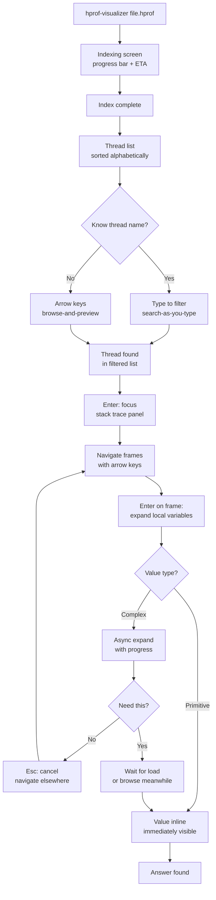
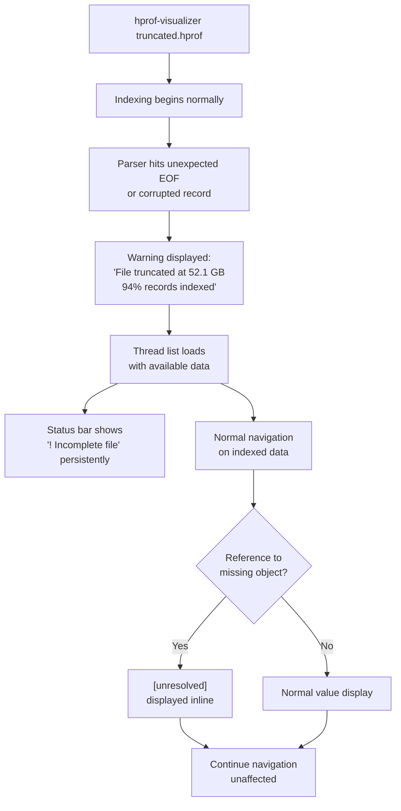
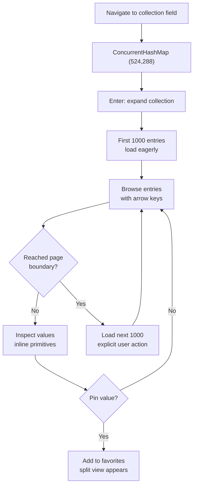
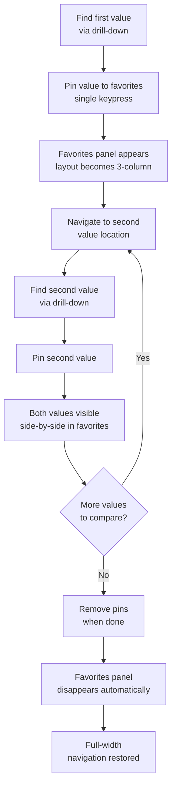

# UX Design Specification hprof-visualizer

**Author:** Florian
**Date:** 2026-03-06

---

<!-- UX design content will be appended sequentially through collaborative workflow steps -->

## Executive Summary

### Project Vision

hprof-visualizer reimagines heap dump analysis by inverting
the cost model: instead of hours of upfront loading and
total RAM consumption, the cost is distributed — seconds of
indexing, milliseconds per navigation, and the developer's
machine stays fully usable. The UX must reflect this
philosophy at every level: fast feedback, predictable costs,
zero surprises.

### Target Users

**Primary persona: Production Java Developer (Florian)**
- Senior Java developer on a clustering team
- Analyzes production heap dumps during client incidents
- Technically expert, comfortable with terminal workflows
- Knows which threads to inspect (most of the time) but
  sometimes must explore when thread pool naming is
  inconsistent
- Compares configuration values vs cluster candidate state
  — currently done via paper notes and scrolling
- Uses analysis tools infrequently (incident-driven), so
  the tool must be immediately usable without relearning
- Deep frustration with accidental expensive operations in
  existing tools (VisualVM field expansion triggering
  minutes-long computations with no way to cancel)

### Key Design Challenges

1. **Non-blocking interactions** — Every expansion is an
   async background operation. The UI never freezes. A
   progress bar shows status and the user can cancel at
   any time. The "accidental expensive expansion" trap
   is eliminated by design — not by warnings, but by
   keeping the app fully interactive at all times.
2. **Thread discovery under pressure** — With 300+ threads
   and sometimes incorrect pool naming, finding the right
   thread must be fast and forgiving. Substring search is
   necessary but may not be sufficient alone.
3. **Value comparison workflow** — The core use case
   (comparing cluster config vs candidate state) currently
   relies on paper notes. Favorites with automatic split
   view internalize this workflow directly in the tool.
4. **Incident-driven usage pattern** — The tool is used
   infrequently, under time pressure, during client
   incidents. Zero learning curve, zero configuration
   ceremony, immediate productivity on every launch.

### Design Opportunities

1. **Async-first interaction model** — All potentially
   expensive operations run in background. The user can
   launch multiple expansions across different threads
   while thinking, compressing time-to-answer. This
   fundamentally changes the analysis experience from
   "wait then act" to "explore while loading".
2. **Conditional split view with favorites** — Pinning
   values automatically activates a side-by-side panel
   (navigation left, favorites right). No favorites = full
   width. The layout adapts to user state, not the
   other way around. This eliminates paper note-taking.
3. **Predictable pagination** — First 1000 elements load
   eagerly on expansion. Subsequent blocks of 1000 are
   loaded explicitly by the user. No surprises, no
   runaway memory consumption.
4. **Brutal simplicity** — One argument, one screen, drill
   down. No wizards, no project setup, no configuration
   dialogs. The tool respects the urgency of its context.

## Core User Experience

### Defining Experience

The core interaction is **vertical drill-down**: threads
-> stack frames -> local variables -> recursive object
expansion. Every session follows this spine. All other
features (favorites, search, pagination) are satellites
orbiting this primary navigation axis.

The secondary interaction is **value comparison**: pinning
discovered values as favorites and viewing them side-by-side
to confirm or disprove a hypothesis about system state.

### Platform Strategy

- **Platform:** Terminal UI (ratatui + crossterm)
- **Input:** Keyboard only, no mouse interaction
- **Distribution:** Single compiled binary, no runtime
  dependencies
- **Context:** Local binary reading a local file, no
  network, no cloud, no accounts
- **Constraints:** Terminal width (typically 80-200
  columns), no rich visuals, monospace font only
- **Cross-platform:** Linux, macOS, Windows

### Effortless Interactions

1. **File to thread list** — One CLI argument, indexing
   with progress bar, thread list appears. Zero prompts,
   zero configuration dialogs, zero intermediate screens.
2. **Thread search** — Type to filter instantly. No
   "search mode" to enter, no Enter key to confirm.
   Live filtering as the user types.
3. **Primitive values** — Displayed inline next to field
   names. Strings, numbers, booleans, nulls visible
   without any expansion action.
4. **Cost preview** — Collection sizes and object
   complexity visible before expansion. The user always
   knows what will happen before acting.
5. **Pinning** — One keypress to pin a value to favorites.
   One keypress to remove. No naming, no organizing, no
   drag-and-drop.

### Critical Success Moments

1. **"It opened"** — A 65 GB file is usable within
   minutes, not hours. The machine stays responsive.
   This is the first trust moment.
2. **"I found it"** — The user navigates from thread list
   to the exact value they need without getting lost,
   without accidental freezes, without dead ends. The
   drill-down felt inevitable, not exploratory.
3. **"I can compare"** — Two values pinned side-by-side
   confirm or deny the hypothesis. No paper notes, no
   switching windows, no memory required.
4. **"I can cancel"** — An expensive expansion is running
   but the user realizes they picked the wrong object.
   They cancel, navigate elsewhere, zero time wasted.
   The trap is gone.

### Experience Principles

1. **Never block, never trap** — Every operation is
   async and cancellable. The UI is always responsive.
   The user is always in control.
2. **Cost before commitment** — The user always sees
   what an action will cost (size indicators, entry
   counts) before triggering it. No surprises.
3. **Zero ceremony** — No setup, no wizards, no
   configuration required. One argument in, thread
   list out. The tool respects the urgency of incident
   response.
4. **State follows action** — The interface adapts to
   what the user is doing. Favorites appear? Split view
   activates. Favorites gone? Full width returns. No
   manual layout management.
5. **Keyboard fluency** — Every action reachable by
   keyboard with minimal keystrokes. Navigation feels
   like vim: fast, predictable, muscle-memory friendly.

## Desired Emotional Response

### Primary Emotional Goals

- **Control** — The user drives the tool, never the
  reverse. Every action is predictable, every operation
  cancellable. The user never feels at the mercy of a
  loading process.
- **Confidence** — Values displayed are byte-accurate.
  The user can base production decisions on what they
  see without second-guessing the tool's correctness.
- **Relief** — A 65 GB file is no longer a threat. The
  machine stays usable. The tool handles the size so
  the user doesn't have to worry about it.

### Emotional Journey Mapping

| Stage | Emotion | Trigger |
|-------|---------|---------|
| Launch + indexing | Informed serenity | Progress bar with speed/ETA, machine stays responsive. Indexing is a natural pause — coffee break, ticket review. The ETA is permission to let go. |
| Indexing complete | Relief + readiness | Data is complete and reliable. Zero doubt about completeness. The user returns focused. |
| Thread discovery | Focus | Instant search filtering, clear thread list |
| Drill-down navigation | Control | Sub-second responses, inline primitives |
| Object expansion | Serenity | Async loading, cancel anytime, cost preview |
| Value comparison | Confidence | Side-by-side favorites, byte-accurate data |
| Corrupted file | Trust | Graceful warning, partial data usable |
| Task complete | Satisfaction | Answer found without machine abuse |

### Micro-Emotions

- **Confidence over doubt** — Forensic accuracy means
  the user never questions if a value is correctly
  parsed. Trust is earned by correctness. Data is
  always complete — navigation starts only after full
  indexing, eliminating any "is this all?" uncertainty.
- **Serenity over anxiety** — Cost indicators and async
  operations eliminate the fear of "what happens if I
  click this?" that plagues existing tools.
- **Focus over confusion** — The vertical drill-down
  spine keeps the user oriented. Breadcrumb-like context
  (which thread, which frame) prevents "where am I?"
  moments.

### Design Implications

- **Control** -> Every loading operation shows progress
  and offers cancel. No modal dialogs that block input.
  No operations without an escape route.
- **Confidence** -> Values are displayed exactly as
  parsed from the binary format. No rounding, no
  truncation, no interpretation. Status bar indicates
  file integrity (complete vs truncated).
- **Relief** -> Memory budget enforced silently. The
  user never sees OS swap pressure. LRU eviction is
  invisible — re-navigation just re-parses
  transparently. Indexing progress bar with ETA lets
  the user step away and return at the right time.
- **Serenity** -> Collection sizes shown before
  expansion. Pagination is explicit. Async expansion
  means the user is never trapped waiting.

### Emotional Design Principles

1. **Predictability breeds trust** — Same action, same
   result, same speed. No variance in behavior based
   on hidden state. The user builds muscle memory and
   confidence simultaneously.
2. **Transparency without noise** — Show what matters
   (progress, sizes, warnings) but never overwhelm.
   Status bar for persistent info, inline indicators
   for contextual info, nothing more.
3. **Graceful degradation preserves calm** — Corrupted
   files, missing references, truncated data — all
   handled with warnings, never crashes. The user's
   emotional state should never go from "focused" to
   "panicked" because of the tool.
4. **Complete data, complete trust** — Navigation
   begins only after indexing is fully complete. No
   partial results, no "still loading" caveats. When
   the user starts exploring, every thread, every
   frame, every reference is available.

## UX Pattern Analysis & Inspiration

### Inspiring Products Analysis

**lazygit (TUI reference)**
- Multi-panel layout with keyboard-driven focus
  switching between panels
- Dense information display without feeling cluttered
- Each panel has a clear, focused responsibility
- Adopted as the primary layout model for
  hprof-visualizer's Threads view

**htop (TUI reference)**
- Familiar TUI conventions for keyboard navigation
- Real-time data display with responsive UI
- Demonstrates that TUI can feel fast and polished

**VisualVM (domain reference)**
- Thread list with state indicators, stack frames with
  local variables displayed as expandable tree
- Data organization and sections to preserve: same
  data model, improved presentation
- Pain points to fix: blocking expansions, full memory
  load, no comparison workflow

**IntelliJ / VS Code (IDE reference)**
- Tree view navigation patterns for hierarchical data
- Inline expansion of nested structures
- Split view and panel management conventions

### Transferable UX Patterns

**Navigation Patterns:**
- **lazygit multi-panel:** Two main columns in Threads
  view — thread list (left, narrow) and stack trace
  (right, wide). Third column (favorites) appears
  conditionally when pins exist.
- **View switching (Phase 2):** Summary and Threads as
  two top-level views, switchable via keyboard shortcut.
  MVP ships with Threads view only. The view switch
  mechanism is documented but not implemented until
  Summary content exists. No placeholder tab or empty
  view in MVP.

**Information Display Patterns:**
- **Responsive thread info:** Thread state displayed
  on the same line as thread name when space permits,
  otherwise below with indentation to visually
  distinguish it from thread names. Layout adapts to
  available terminal width.
- **VisualVM-style inline variables:** Local variables
  displayed as expandable tree nodes directly under
  the selected stack frame in the stack trace column.
  No separate panel for variables in MVP.
- **Inline primitives:** Primitive values, nulls, and
  short strings shown directly on the tree node line.
  Complex objects show type + size indicator and
  require explicit expansion.

**Tree View Implementation:**
- The stack trace column is a recursive tree: frames
  -> variables -> objects -> fields -> sub-objects.
  Displayed as a flattened list with depth-based
  indentation (2 chars per level). Expansion
  indicators: `>` collapsed, `v` opened.
- **Deep nesting strategy (3 complementary mechanisms):**
  1. Truncation with full display on focus — long type
     names like `ConcurrentHashMap$TransferNode` are
     truncated with `...` and shown in full when the
     node is selected.
  2. Compact indentation — 2 chars per depth level,
     balancing readability with space efficiency.
  3. Auto-focus horizontal scroll — the viewport shifts
     horizontally to follow the focused node's depth.
     At depth 6+, parent indentation scrolls off-screen
     left, giving the active level full available width.
     A small margin preserves visibility of the
     immediate parent for context.

**Interaction Patterns:**
- **Panel focus switching:** Keyboard shortcut to move
  focus between thread list and stack trace panels
  (and favorites when visible)
- **Tree expand/collapse:** Enter or arrow keys to
  expand objects, consistent with file explorer
  conventions

### Anti-Patterns to Avoid

- **VisualVM blocking expansion** — Clicking a field
  can freeze the entire UI for minutes. Eliminated by
  async-first model with cancellation.
- **Full memory load before navigation** — Loading
  entire heap into RAM before any interaction.
  Eliminated by mmap + lazy parsing.
- **Modal confirmation dialogs** — "Are you sure you
  want to expand this?" breaks flow. Replaced by
  cost indicators + async non-blocking expansion.
- **Hidden state changes** — Operations that silently
  consume memory or trigger background work without
  feedback. Every operation shows its cost and
  progress.
- **Complex panel management** — Manual resize, drag,
  dock/undock panels. The layout is automatic and
  state-driven — no user configuration needed.
- **Placeholder UI for future features** — Empty tabs,
  grayed-out buttons, "coming soon" labels. If a
  feature isn't implemented, its UI doesn't exist.

### Design Inspiration Strategy

**What to Adopt:**
- lazygit's multi-panel columnar layout with keyboard
  focus switching — direct fit for thread list + stack
  trace + favorites
- VisualVM's data model and tree expansion pattern for
  stack frames and local variables — familiar to the
  target user
- htop's responsive TUI feel — fast, no lag, keyboard
  fluent

**What to Adapt:**
- lazygit's panel proportions — stack trace panel needs
  to be dominant (widest) since that's where the core
  drill-down happens
- VisualVM's tree view — add size/complexity indicators
  before expansion, add async loading for heavy nodes
- Thread state display — responsive layout (inline vs
  indented below) based on available width
- Deep tree navigation — auto-focus horizontal scroll
  to keep active content visible at any depth

**What to Avoid:**
- VisualVM's blocking interaction model
- Complex panel configuration or manual layout control
- Any modal dialog that interrupts navigation flow
- UI elements for unimplemented features

## Design System Foundation

### Design System Choice

**Custom minimal TUI theme** — A lightweight set of
visual conventions built on ratatui's `Style`, `Color`,
and `Modifier` primitives. No external design system
framework. A single `theme.rs` module defines named
style constants for consistent reuse across all views.

### Rationale for Selection

- No established TUI design system exists for this
  domain — web-oriented systems (Material, Tailwind)
  do not apply
- ratatui provides sufficient primitives for a
  cohesive visual language
- Solo developer project — a minimal convention set
  is maintainable without design tooling overhead
- TUI constraints (monospace, limited colors, no
  rich graphics) make a simple approach optimal

### Implementation Approach

**Color Palette (16 ANSI base colors only):**
- No 256-color or RGB — 16 ANSI colors are
  universally supported across all target terminals
  (Windows Terminal, iTerm2, gnome-terminal, alacritty)
- No capability detection or fallback code needed

**Thread State Indicators:**
- Colored dot `o` next to thread name (no text label
  in the list): green (RUNNABLE), yellow (WAITING /
  TIMED_WAITING), red (BLOCKED)
- Legend bar at the bottom of the thread list panel:
  `o Running  o Waiting  o Blocked` — always visible,
  self-documenting
- Full state text (e.g., TIMED_WAITING) displayed in
  status bar when thread is selected — distinguishes
  substates without consuming list space

**Value Colors:**
- Java types: cyan
- Field names: white
- Values by type: green (strings), yellow (numbers),
  dim/dark gray (null)
- Warnings: yellow text
- Errors: red text
- Selected/focused: reverse video or bold

**Typography Conventions:**
- Bold: panel titles, focused item
- Dim: secondary info (metadata, null values)
- Normal: primary content (field names, values)

**Visual Indicators (ASCII only, cross-platform):**
- `>` collapsed, `v` expanded (tree nodes)
- `*` pinned favorite
- `~` loading/async operation in progress
- `!` warning indicator (truncated file, unresolved
  reference)

**Layout Conventions:**
- Panel borders: single-line box drawing characters
- Panel titles: bold, centered in top border
- Thread list panel: ~25-30% width
- Stack trace panel: remaining width (grows/shrinks
  with favorites)
- Favorites panel: ~25% width when visible
- Status bar: bottom row, full width, persistent
  file info + warnings + selected thread state

### Customization Strategy

- All style definitions centralized in `theme.rs`
  as named constants with `//!` module docstring
  documenting the complete semantic color vocabulary
- Future: user-configurable color scheme via
  `config.toml` (post-MVP)

## Defining Core Experience

### Defining Experience

**"Open a heap dump of any size and find the value you
need in minutes, not hours."**

The defining interaction is the vertical drill-down:
thread -> stack frame -> local variable -> value. The
user arrives with a question ("what is the value of
this field in this thread?") and the tool conducts
them to the answer via the shortest path. Everything
else — favorites, search, pagination — exists to
support this spine.

### User Mental Model

The target user already thinks in trees — this is
the VisualVM model they know. A thread contains
frames, a frame contains variables, a variable can
be an object with fields. The mental model is
**established, not novel**. Innovation happens in
performance and non-blocking behavior, not in
navigation structure.

**Current workflow (VisualVM):**
- Same tree model, but blocking and memory-hungry
- Accidental expansions freeze the UI for minutes
- No comparison workflow — paper notes required
- Machine becomes unusable during analysis

**Expected workflow (hprof-visualizer):**
- Same tree model, but async and lightweight
- Every expansion is non-blocking and cancellable
- Favorites + split view replace paper notes
- Machine stays fully usable throughout

The user does not need to learn a new model. They
need their existing model to *work* on large files.

### Success Criteria

1. **Speed** — Every navigation step responds in
   under 1 second. The user never waits between
   clicks during drill-down.
2. **Orientation** — The user always knows where
   they are: which thread, which frame, which depth
   level. Context is visible, not memorized.
3. **Safety** — No action blocks the UI. No action
   is irreversible. Every expansion can be cancelled.
   Every collapsed subtree can be re-expanded with
   identical results.
4. **Accuracy** — Values displayed match the binary
   content of the hprof file exactly. The user can
   make production decisions based on what they see.
5. **Completion** — The user found their answer and
   can close the tool. No cleanup, no swap pressure,
   no machine recovery needed.

### Novel UX Patterns

**Established patterns adopted:**
- Tree view with expand/collapse (file explorer
  convention, VisualVM familiarity)
- Panel-based layout with keyboard focus switching
  (lazygit convention)
- Search-as-you-type filtering (universal pattern)
- Progress bar with ETA (universal pattern)

**Novel patterns introduced:**
- **Async-first expansion** — All object expansions
  run in background with progress and cancel. This
  is unusual for tree views but necessary for the
  domain. The user will discover this naturally when
  they see the loading indicator and realize they
  can keep navigating.
- **Conditional split view** — Favorites panel
  appears/disappears based on pin state. No manual
  layout management. Novel for TUI applications but
  intuitive — the UI reflects the user's intent.
- **Cost transparency** — Collection sizes and
  complexity visible before expansion. Common in
  IDEs (e.g., debugger showing array length) but
  elevated to a core design principle here.
- **Browse-and-preview** — Stack trace panel updates
  in real-time as the user navigates the thread list
  with arrow keys. No Enter required to preview a
  thread's frames. This enables rapid thread
  identification by scanning stack traces when thread
  names are unhelpful (e.g., poorly named pools).

No user education needed — novel patterns are
discoverable through natural interaction.

### Experience Mechanics

**1. Initiation:**
- User launches `hprof-visualizer <file>`
- Indexing progress bar with speed and ETA
- On completion: thread list appears in left panel
  sorted alphabetically, with colored state dots
  and search ready

**2. Thread Discovery:**
- Arrow keys to browse — stack trace panel updates
  in real-time with each selection change (browse-
  and-preview, no Enter needed)
- Type to filter live (search-as-you-type). No
  matches displays "No matches". Esc clears the
  filter and restores the full list.
- This enables two discovery modes:
  - **Known thread:** type name substring, select
  - **Unknown thread:** arrow through list, scan
    stack traces visually until the right one is
    found

**3. Drill-Down Entry:**
- Enter on a thread switches focus to the stack
  trace panel for variable exploration
- Arrow keys to navigate frames within the panel
- Enter on a frame expands local variables as
  indented tree nodes below the frame

**4. Value Inspection:**
- Primitives, nulls, short strings: inline, no
  action needed
- Complex objects: type + size indicator shown,
  Enter to expand async
- Loading indicator on the node during expansion,
  cancellable with Esc
- Expanded fields appear as deeper indented nodes

**5. Value Capture:**
- Single keypress to pin current value to favorites
- Favorites panel appears automatically (split view)
- Pin indicator (`*`) shown on the pinned node

**6. Resolution:**
- Values compared side-by-side in favorites panel
- User has their answer
- Close with `q` — clean exit, no cleanup

## Visual Design Foundation

### Color System

Fully defined in Design System Foundation above.
16 ANSI base colors, semantic mapping for thread
states, value types, warnings, and errors. No
custom palette — terminal standard colors ensure
universal compatibility.

**Key principle:** Color is never the sole carrier
of information. Every colored element has a
companion text indicator or legend.

### Typography System

**Font:** Monospace — imposed by terminal context.
No font selection, no font pairing, no type scale.

**Hierarchy through style modifiers:**
- **Bold** — Panel titles, focused/selected items,
  section headers
- **Dim/DarkGray** — Secondary info (null values,
  metadata, unfocused elements)
- **Normal** — Primary content (field names, values,
  stack frames)
- **Reverse video** — Current selection highlight
- **Color** — Semantic meaning (types, states,
  values) as defined in color system

No h1/h2/h3 hierarchy — TUI information hierarchy
is expressed through panel structure, indentation,
and style modifiers.

### Spacing & Layout Foundation

**Density: High — every line carries information.**

This is a forensic analysis tool, not a consumer
app. Screen real estate is maximized for data
display.

**Spacing rules:**
- **Indentation:** 2 characters per depth level in
  tree views
- **Inter-section spacing:** 1 empty line between
  logical groups within a panel (e.g., between stack
  frames when variables are collapsed)
- **Panel borders:** Single-line box drawing
  characters, no additional padding inside panels
- **Status bar:** Pinned to bottom row, no margin,
  full terminal width
- **No decorative spacing** — No empty lines for
  aesthetics. Every blank line serves a readability
  purpose.

**Layout proportions (Threads view):**
- Thread list panel: ~25-30% terminal width
- Stack trace panel: remaining width
- Favorites panel (when visible): ~25% width,
  taken from stack trace panel
- Minimum usable terminal width: 80 columns

### Accessibility Considerations

- **Color independence:** Every colored element has
  a non-color companion (legend for thread states,
  distinct ASCII characters for indicators)
- **Contrast:** ANSI colors on dark terminal
  background provide sufficient contrast by default.
  User's terminal theme controls exact rendering.
- **Keyboard-only:** Full functionality without mouse
  — inherent to TUI design
- **Screen reader:** Not targeted in MVP. TUI
  frameworks have limited screen reader support.
  Future consideration if open-source adoption
  warrants it.

## Design Direction Decision

### Design Directions Explored

HTML mockups not applicable — TUI monospace context
limits visual variation. Design direction explored
through ASCII wireframes showing the 3 key interface
states that cover the full user journey.

### Chosen Direction

**Single direction — constraint-driven design.**

The TUI context produces one natural layout that
follows directly from our architectural and UX
decisions. No alternative directions were needed
because the constraints (monospace, keyboard-only,
panel-based, lazygit-inspired) converge to a single
coherent design.

### Interface States

**State 1: Indexing**
```
┌─────────────────────────────────────────────┐
│            hprof-visualizer v0.1            │
│                                             │
│                                             │
│  Indexing: production-server.hprof          │
│                                             │
│  [████████████░░░░░░░░░░░] 52%              │
│  34.1 GB / 65.0 GB   2.3 GB/s   ETA 0:13   │
│                                             │
│                                             │
│                                             │
├─────────────────────────────────────────────┤
│ production-server.hprof  65.0 GB  v1.0.2    │
└─────────────────────────────────────────────┘
```

- Centered progress bar with speed, bytes
  processed, and ETA
- File metadata in status bar (name, size, version)
- Clean, focused — nothing else to distract

**State 2: Threads view (navigation)**
```
┌─ Threads (312) ────────┬─ Stack Trace ─────────────────────┐
│ /cluster               │ at c.a.cluster.Resolver.find(87)  │
│                        │   v candidate: ClusterNode        │
│ o cluster-heartbeat-1  │     id: long = 4829174            │
│ o cluster-resolver-3   │     name: String = "node-eu-3"    │
│ o cluster-worker-1     │     > config: HashMap (12)        │
│ o cluster-worker-2     │     > metrics: TreeMap (48)       │
│ o cluster-worker-3     │   > context: AppContext            │
│ o main                 │ at c.a.cluster.Engine.run(214)     │
│ o pool-1-thread-1      │ at c.a.core.Bootstrap.main(45)    │
│ o pool-1-thread-2      │                                    │
│ o pool-1-thread-3      │                                    │
│ o signal-handler       │                                    │
│                        │                                    │
│ o Running o Wait o Blk │                                    │
├────────────────────────┴────────────────────────────────────┤
│ cluster-resolver-3  RUNNABLE  |  65.0 GB  v1.0.2  ok       │
└─────────────────────────────────────────────────────────────┘
```

- Left panel: thread list with colored state dots,
  search filter active (`/cluster`), legend at bottom
- Right panel: stack trace with tree view, inline
  primitives, expand indicators with collection sizes
- Status bar: selected thread full state, file info,
  integrity indicator
- Browse-and-preview: stack trace updates in real-time
  with thread selection

**State 3: Threads view with Favorites**
```
┌─ Threads (312) ──┬─ Stack Trace ──────────────┬─ Favorites ──────┐
│ o cluster-res-3  │ at c.a.cluster.Resolver...  │ * node-eu-3      │
│ o cluster-wrk-1  │   v candidate: ClusterNode  │   name = "no.."  │
│ o cluster-wrk-2  │     id: long = 4829174      │   port = 8443    │
│ o cluster-wrk-3  │     name: String = "nod.."  │                  │
│ o main           │     > config: HashMap (12)  │ * node-us-1      │
│ o pool-1-thrd-1  │     > metrics: TreeMap (48) │   name = "no.."  │
│ o pool-1-thrd-2  │   > context: AppContext     │   port = 8443    │
│                  │                             │                  │
│ o Run o Wt o Blk │                             │                  │
├──────────────────┴─────────────────────────────┴──────────────────┤
│ cluster-resolver-3  RUNNABLE  |  65.0 GB  v1.0.2  ok             │
└──────────────────────────────────────────────────────────────────┘
```

- Third panel appears automatically when favorites
  exist
- Thread names and values truncated to fit narrower
  panels
- Pinned values displayed with `*` prefix
- All three panels keyboard-navigable with focus
  switching

### Design Rationale

- **Constraint-driven:** TUI + monospace + keyboard
  naturally converges to this layout. No subjective
  aesthetic choices needed.
- **lazygit-inspired:** Multi-panel with clear
  responsibilities, proven TUI pattern
- **Progressive disclosure:** Indexing -> 2 panels
  -> 3 panels. Complexity appears only when needed.
- **Information density:** Every character on screen
  serves a purpose. No decorative elements.

## User Journey Flows

### Journey 1: Targeted Value Inspection

**Goal:** Find a specific variable value in a
production heap dump as fast as possible.



**Key interaction points:**
- Search or browse: two discovery modes for the
  same goal
- Async expansion: never blocks, always cancellable
- Browse-and-preview: stack trace updates without
  Enter during thread browsing

### Journey 2: Corrupted Heap Dump

**Goal:** Extract usable data from a truncated or
corrupted heap dump file.



**Key interaction points:**
- Warning is informational, not blocking
- Status bar persists the incomplete file indicator
- Unresolved references show `[unresolved]` inline
- Navigation continues normally on available data

### Journey 3: Large Collection Browsing

**Goal:** Inspect entries in a collection with 500K+
elements without consuming all memory.



**Key interaction points:**
- Collection size visible before expansion (cost
  transparency)
- First 1000 eager, subsequent blocks explicit
- LRU evicts scrolled-past pages silently
- Memory stays within budget regardless of
  collection size

### Journey 4: Value Comparison

**Goal:** Compare values from different locations
in the heap dump (e.g., cluster config vs candidate
state).



**Key interaction points:**
- One keypress to pin, one to unpin
- Layout adapts automatically to pin state
- No limit on number of pins (memory-managed
  by LRU like everything else)
- Comparison is spatial (side-by-side), not
  temporal (switching between views)

### Journey Patterns

**Reusable patterns across all journeys:**

1. **Drill-down spine** — Every journey passes
   through the same navigation axis: threads ->
   frames -> variables -> values. Consistent
   regardless of goal.
2. **Async with escape** — Any potentially slow
   operation runs async with Esc to cancel. Same
   pattern for object expansion, collection loading.
3. **Graceful degradation** — Missing data never
   stops navigation. Truncated files, unresolved
   references, corrupted records — all produce
   inline markers, never dead ends.
4. **Progressive layout** — UI complexity matches
   user intent. No favorites = 2 panels. Has
   favorites = 3 panels. Indexing = 1 panel.

### Flow Optimization Principles

1. **Minimum steps to value** — From launch to
   answer in 6 interactions: launch -> index (wait)
   -> search/browse -> enter thread -> expand frame
   -> read value.
2. **No dead ends** — Every state has a clear next
   action. Error states include the path forward.
3. **Parallel progress** — User can browse while
   expansions load. Multiple async operations can
   run simultaneously.
4. **Zero cleanup** — Close with `q`. No save
   dialogs, no "are you sure?", no temp files to
   clean, no swap to recover from.

## Component Strategy

### Design System Components

**ratatui built-in widgets used:**
- `Block` — Panel borders with titles (all panels)
- `List` — Base for scrollable lists (thread list
  foundation)
- `Paragraph` — Formatted text display (status bar,
  info sections)
- `Gauge` — Progress bar (indexing screen)
- `Layout` — Panel splitting with constraints
  (horizontal for columns, vertical for status bar)

These cover structural and layout needs. All
domain-specific UI requires custom widgets.

### Custom Components

**TreeView**
- **Purpose:** Display hierarchical data — stack
  frames, local variables, nested objects — as a
  navigable, expandable tree
- **Content:** Frame names, variable names, type
  indicators, inline primitive values, collection
  size hints
- **States:** Collapsed (`>`), expanded (`v`),
  loading (`~ Loading... 45%`), failed
  (`! Failed to load: <reason>`), focused
  (bold/reverse), unfocused (normal), unresolved
  (`[unresolved]`)
- **Interactions:** Enter to expand/collapse, Esc to
  cancel async load on focused node, arrow keys to
  navigate, pin keypress to favorite
- **Async loading pattern:** When a node is expanded
  and requires async loading, a pseudo-child node
  `~ Loading... {progress}%` appears at depth + 1
  beneath the parent. On success, the pseudo-node is
  replaced by real children. On failure, it becomes
  `! Failed to load: <reason>`. On cancel (Esc),
  the pseudo-node is removed and the parent reverts
  to collapsed. Multiple nodes can load in parallel,
  each with its own independent pseudo-node.
- **Stateless rendering:** The widget reads the
  current state from the NavigationEngine at each
  render tick (16ms). No internal async state — if
  an expansion completes between renders, the node
  transitions from loading to expanded automatically.
- **Complexity:** Highest — handles async expansion,
  depth-based indentation, auto-focus horizontal
  scroll, pagination boundaries for collections
- **Implementation:** Flattened list with depth
  metadata per node. Each node stores: depth, expand
  state, display content, style. Render as styled
  `ListItem` entries with calculated offsets.

**SearchableList**
- **Purpose:** Thread list with integrated live
  search filtering
- **Content:** Thread names with colored state dots,
  thread count in panel title, search input area at
  top, legend at bottom
- **States:** Normal browsing, search active (input
  visible), no matches ("No matches" displayed),
  empty (no threads)
- **Interactions:** Arrow keys to browse (triggers
  browse-and-preview), type to filter, Esc to clear
  filter, Enter to focus stack trace panel
- **Selection persistence:** Selection tracked by
  `thread_id`, not list index. When filter changes,
  if the selected thread is still visible it stays
  selected. If filtered out, selection moves to the
  first visible thread.
- **Implementation:** Wraps ratatui `List` with a
  filter predicate and input capture mode. Filtered
  list re-renders on each keystroke.

**FavoritesPanel**
- **Purpose:** Display pinned values for side-by-side
  comparison
- **Content:** Pinned value labels with `*` prefix,
  value details (type, primitive values)
- **States:** Visible (has pins), hidden (no pins).
  No intermediate state — binary presence.
- **Interactions:** Navigate pinned items, unpin with
  keypress, focus switching from other panels
- **Implementation:** Conditional `Layout` constraint.
  When `favorites.is_empty()`, constraint is
  `Constraint::Length(0)`. Otherwise ~25% width.

**ProgressScreen**
- **Purpose:** Full-screen indexing display during
  first pass
- **Content:** File name, progress gauge, bytes
  processed / total, speed (GB/s), ETA
- **States:** Indexing in progress, indexing complete
  (transitions to Threads view)
- **Interactions:** None — passive display. User
  waits (coffee break). No cancel for indexing in
  MVP.
- **Implementation:** Centered `Gauge` with
  surrounding `Paragraph` blocks for metadata. Full
  screen, replaces all other UI during indexing.

**StatusBar**
- **Purpose:** Persistent bottom bar with contextual
  and file-level information
- **Content:** Selected thread name + full state
  text, file name + size + version, integrity
  indicator (`ok` or `! Incomplete`)
- **States:** Normal (complete file), warning
  (truncated/corrupted file — `!` indicator persists)
- **Interactions:** None — read-only information
  display
- **Implementation:** Single-row `Paragraph` with
  multiple styled `Span` sections separated by `|`.

### Component Implementation Strategy

- All custom widgets live in `crates/hprof-tui/src/`
  under `views/` (domain widgets) or as standalone
  modules (generic reusable widgets)
- Each widget implements ratatui's `Widget` trait or
  `StatefulWidget` for stateful components
- Styles come from `theme.rs` constants — widgets
  never hardcode colors or modifiers
- Widgets receive data as borrowed references from
  the NavigationEngine — they do not own domain data
- Widgets are stateless renderers — async state,
  navigation state, and selection state live in the
  engine or app state, not in widgets

### Implementation Roadmap

**Phase 1 — MVP Core (all required):**
1. ProgressScreen — needed first (indexing is the
   entry point)
2. SearchableList — thread discovery
3. TreeView — the core drill-down widget
4. StatusBar — persistent context
5. FavoritesPanel — value comparison

All 5 widgets are MVP-critical. No phasing within
MVP — they are all needed for the primary journey.

**Phase 2 — Summary view widgets:**
- HeapSummary widget (class instance counts, sizes)
- ViewSwitcher (tab/shortcut to switch Summary <->
  Threads)

## UX Consistency Patterns

### Keyboard Navigation Patterns

**Panel focus switching:**
- Tab or dedicated shortcut to cycle focus between
  panels (thread list -> stack trace -> favorites)
- Focused panel has highlighted border (bold or
  different color)
- Unfocused panels remain visible but visually
  dimmed border

**Within-panel navigation:**
- Arrow Up/Down — move selection one item
- Page Up/Down — move selection one page
- Home/End — jump to first/last item
- Enter — expand/collapse (tree), or switch focus
  to related panel (thread list -> stack trace)
- Esc — cancel current action (async load, search
  filter) or go back (focus from stack trace back
  to thread list)

**Consistent across all panels:** Same keys do
the same thing regardless of which panel is focused.
Arrow keys always navigate, Enter always activates,
Esc always cancels/goes back.

### Feedback Patterns

**Loading states:**
- Indexing: full-screen `Gauge` with speed + ETA
- Async expansion: `~ Loading... {%}` pseudo-node
  in tree at depth + 1
- Pattern: loading indicator always appears *where
  the result will appear*, not in a separate area

**Success states:**
- Silent — no confirmation needed. Expansion
  completes, children appear. Pin added, favorites
  panel appears. The result *is* the confirmation.

**Warning states:**
- `!` prefix in dim yellow
- Inline in context: `! Failed to load: <reason>`
  in tree, `! Incomplete` in status bar
- Never modal, never blocking, never requires
  acknowledgment

**Error states (fatal):**
- Clear message on stderr before exit
- Only for: unreadable file, invalid header, mmap
  failure
- TUI never shows fatal errors — app exits before
  TUI starts

### Search & Filter Patterns

**Search-as-you-type:**
- Active in thread list panel
- Filter input displayed at top of panel
- Results update live with each keystroke
- No matches: "No matches" displayed in list area
- Esc clears filter, restores full list
- Selection preserved by ID when possible

**Pattern rule:** Search is always *filtering*
(reducing a visible list), never *querying*
(fetching new data). Instant, local, no async.

### Keyboard Shortcut Vocabulary

**Global shortcuts (work in any panel):**
- `q` — quit application
- `?` — show help/keybindings overlay
- Pin keypress (e.g., `p`) — pin/unpin focused value

**Contextual shortcuts (depend on focused panel):**
- Enter, Esc, arrows — context-dependent as
  defined above
- `/` — activate search (thread list only)

**Design rules:**
- Single keypress for frequent actions (no Ctrl+
  combinations in MVP)
- No key does something destructive without undo
  (unpin is instant, re-pin is instant)
- `?` help overlay lists all available shortcuts
  for current context

## Responsive Design & Accessibility

### Responsive Strategy

**Terminal-adaptive layout — no pixel breakpoints.**

The TUI adapts to terminal dimensions (columns x
rows), not screen pixels. ratatui's `Layout` with
`Constraint::Percentage` and `Constraint::Min`
handles all resizing automatically.

**Terminal width tiers:**

| Tier | Width | Behavior |
|------|-------|----------|
| Large | >160 cols | All panels comfortable, thread names + state inline, full type names |
| Standard | 80-160 cols | Normal proportions, thread state inline or indented based on space, type names may truncate |
| Narrow | <80 cols | Minimum usable. Thread list and stack trace compressed, favorites panel narrower. Truncation more aggressive. |

**Adaptive behaviors:**
- Thread state: inline when panel width permits,
  indented below when tight
- Type names: full when space available, truncated
  with `...` when tight (always full on focus)
- Panel proportions remain percentage-based —
  panels shrink proportionally, never disappear
- Minimum usable width: 80 columns. Below 80, the
  tool remains functional but display is degraded.

### Terminal Resize Handling

- ratatui handles terminal resize events natively
- Layout recalculates on each render tick
- No special resize logic needed — percentage-based
  constraints adapt automatically
- Selection and scroll positions preserved across
  resizes

### Accessibility Strategy

**Inherent TUI accessibility:**
- Keyboard-only by design — no mouse required
- High contrast: terminal ANSI colors on user's
  chosen background
- No animations, no transitions — instant state
  changes
- Monospace font — consistent character widths,
  predictable alignment

**Color independence (already defined):**
- Colored state dots have text legend
- All indicators use distinct ASCII characters
  (`>`, `v`, `*`, `~`, `!`)
- No information conveyed by color alone

**Not targeted in MVP:**
- Screen reader support (ratatui limitation)
- High contrast mode toggle (user controls via
  terminal theme)
- Font size adjustment (user controls via terminal
  settings)

### Testing Strategy

**Terminal compatibility testing:**
- Windows Terminal, cmd.exe (ASCII fallback)
- iTerm2, Terminal.app (macOS)
- gnome-terminal, alacritty (Linux)
- Verify 16 ANSI colors render correctly
- Verify box drawing characters display properly

**Resize testing:**
- Test at 80, 120, 160, 200+ columns
- Test resize during navigation (preserve state)
- Verify minimum width (80 cols) remains usable

**Keyboard testing:**
- All navigation paths reachable by keyboard
- No dead-end states
- Esc always provides an exit from current context
